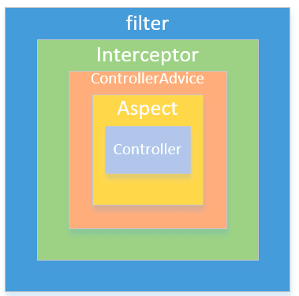

## Filter and Interceptor

### Filter

* Through the filter, we can only obtain the servletRequest object, so we cannot obtain additional information such as
  the name of the method, the class to which it belongs, and the parameters.

### Execution order

* Compared with filters, interceptors could get Object and Exception objects etc., but the filter still cannot get the
  **method parameters**.

The filter is executed before the interceptor and ends after the filter
